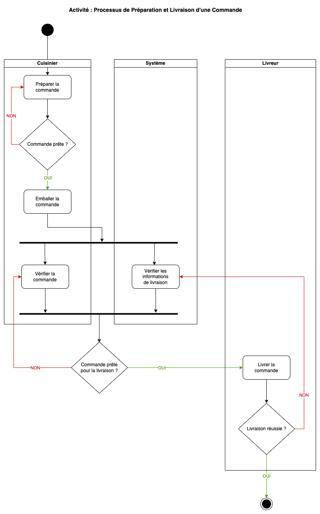
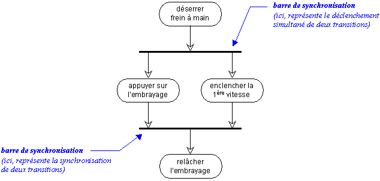
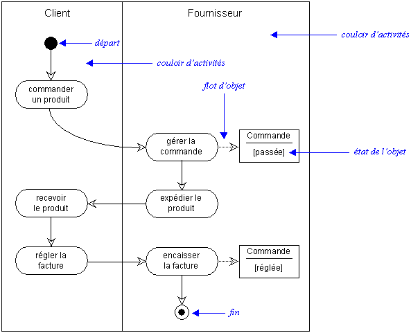
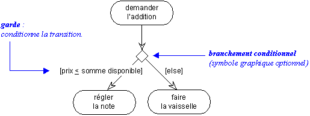

# 03. Le diagramme d'Activité

## Présentation

Les diagrammes d'activité sont des outils essentiels en UML (Unified Modeling Language) pour représenter le flux de
contrôle ou le flux de données d'une activité à l'autre dans un processus. Ils sont souvent comparés à des diagrammes de
flux de processus, car ils montrent la séquence logique d'actions ou d'étapes que le système doit suivre pour accomplir
une tâche. Ces diagrammes sont utilisés dans divers contextes de développement logiciel pour modéliser les workflows,
les algorithmes, les procédures métier, ou les processus complexes.

## Utilité dans le Développement Logiciel

### Modélisation des workflows :

Les diagrammes d'activité aident à visualiser les workflows complexes et à définir clairement les tâches impliquées. En
représentant chaque étape du processus, les équipes de développement peuvent identifier les inefficacités, les doublons,
ou les goulots d'étranglement pour améliorer les performances.

### Conception d'algorithmes :

Lors de la conception d'algorithmes complexes, ces diagrammes permettent de planifier visuellement le cheminement
logique, en veillant à ce que toutes les étapes nécessaires soient présentes, dans le bon ordre.

### Planification des tests :

Comme ces diagrammes détaillent le comportement attendu du système, ils servent de base pour concevoir les scénarios de
test, permettant aux testeurs d'élaborer des plans de test couvrant les différents chemins possibles.

### Optimisation des processus métier :

En modélisant les processus métier existants et en analysant les diagrammes d'activité, les équipes peuvent trouver des
opportunités pour automatiser ou simplifier les tâches, améliorant ainsi l'efficacité organisationnelle.

## Symboles et Éléments

### Activité :

Représentée par un rectangle aux coins arrondis, une activité indique une tâche ou un ensemble de tâches qui font partie
du processus.

### Flèche de contrôle :

Une flèche pointant d'une activité à une autre montre le flux logique du processus, guidant l'ordre d'exécution des
tâches.

### Point de départ :

Représenté par un cercle noir plein, il montre le point où commence le flux de travail.

### Point final :

Représenté par un cercle noir avec un bord épais, c'est le point où se termine le processus.

### Décision :

Un losange indique une décision conditionnelle dans le flux de travail, menant à différents chemins selon les
conditions.

### Mise en parallèle :

Des barres épaisses horizontales représentent des fourches (début de parallélisme) et des jointures (fin du
parallélisme) permettant d'exécuter plusieurs tâches simultanément.  

### Swimlanes :

Ces couloirs regroupent les activités par rôles ou responsabilités, aidant à visualiser les tâches spécifiques à chaque
acteur ou sous-système impliqué dans le processus.  

### Fork (fourche) :

Le fork est représenté par une barre horizontale ou verticale. Il permet de diviser un flux d'exécution unique en
plusieurs flux parallèles. À partir d'un fork, plusieurs activités peuvent se dérouler en parallèle, chacune sur un
chemin différent.

### Join (jonction) :

Le join est aussi représenté par une barre horizontale ou verticale, comme le fork. Il permet de synchroniser des flux
parallèles en un flux unique. Autrement dit, il attend que tous les chemins précédents se terminent avant de continuer
l'exécution.

### Merge (fusion) :

Le merge est représenté par un losange. Contrairement au fork/join, il s'agit de fusionner plusieurs chemins alternatifs
en un seul flux. Il ne nécessite pas d'attendre que plusieurs activités parallèles se terminent.

### Guard (garde) :

Une guard est une condition placée sur une transition entre deux activités. Elle est représentée par une expression
booléenne entre crochets, associée à une flèche de transition. Elle définit si le flux d'activité peut continuer ou non
en fonction de cette condition.

#### Différences clés :

- Fork et join sont liés aux flux parallèles. Le fork divise un flux en plusieurs, tandis que le join synchronise
  plusieurs flux parallèles en un seul.
- Merge concerne les chemins alternatifs (pas parallèles), il permet de fusionner différents chemins possibles sans
  attendre d'autres flux.
- Guard est une condition de contrôle sur une transition, dictant si une activité peut être exécutée ou non en fonction
  d'une condition spécifique.

## Exercices pratiques

### [Plateforme de Gestion d'Événements pour Entreprises](../Exercices/Énoncé/03%20-%20Diagramme%20d'Activité%20-%20Exercice%201.md)

### [Processus de commande d'un site de vente en ligne](../Exercices/Énoncé/03%20-%20Diagramme%20d'Activité%20-%20Exercice%202.md)
