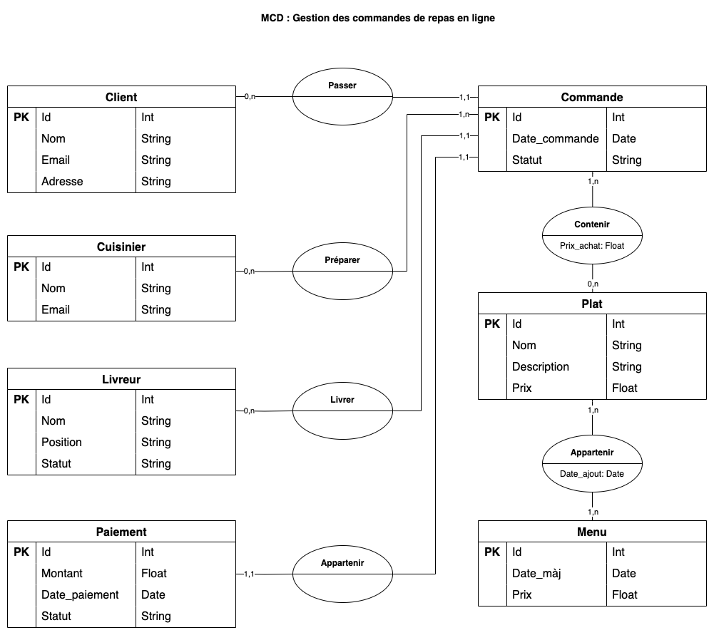
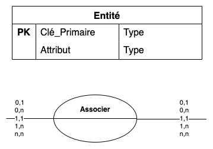

# 01a. Le Modèle Conceptuel des Données (MCD)

## Présentation

Le Modèle Conceptuel des Données (MCD) est l’un des éléments centraux de la méthode Merise. Il permet de représenter de
manière abstraite les données nécessaires au fonctionnement d’un système d’information. Le MCD se concentre sur
l’identification des entités (objets d’intérêt pour l’entreprise) et des relations entre ces entités, sans se préoccuper
des aspects techniques ou des contraintes liées à l’implémentation dans une base de données.

L'objectif principal du MCD est de garantir une compréhension claire et partagée des données du système par l'ensemble
des parties prenantes (analystes, développeurs, utilisateurs métiers). Le MCD facilite la communication et assure que
toutes les données et leurs interactions sont bien modélisées avant d'envisager la transformation technique des concepts
en modèles physiques.

## Utilité du MCD

Le MCD est un outil fondamental pour l'analyse et la conception des systèmes d'information, car il permet :

- De modéliser les données de manière indépendante des aspects techniques.
- D'identifier les entités et les relations importantes du système.
- D'assurer l'intégrité des données en précisant les règles de gestion (cardinalités, contraintes).
- De servir de base à la génération du Modèle Logique des Données (MLD) et du Modèle Physique des Données (MPD).
- De clarifier et de documenter les besoins métiers en termes de données, facilitant ainsi la collaboration entre les
  équipes techniques et non techniques.

## Symboles du MCD

Le MCD utilise un ensemble de symboles standards pour représenter les entités, les relations et les contraintes. Voici
les principaux éléments :

- **Entité :** Représentée par un rectangle, une entité correspond à un objet du monde réel ou du système d'information.
  Chaque entité possède des attributs, qui sont les propriétés ou caractéristiques de l’entité (par exemple, pour une
  entité "Client", les attributs peuvent être "Nom", "Prénom", "Adresse", etc.).

- **Relation :** Représentée par un losange, la relation symbolise un lien entre deux (ou plusieurs) entités. Une
  relation permet de modéliser les interactions entre ces entités. Par exemple, une relation entre "Client" et "
  Commande" permet de représenter le fait qu’un client passe une commande.

- **Cardinalité :** Elle indique le nombre minimum et maximum d'occurrences d'une entité qui peuvent être associées à
  une autre entité dans le cadre d'une relation. Les cardinalités sont souvent notées sous la forme de paires (0,1), (
  1,1), (0,N), ou (1,N). Par exemple, une relation entre "Client" et "Commande" pourrait avoir une cardinalité (1,N)
  pour "Client", indiquant qu'un client peut passer plusieurs commandes.

- **Associations fortes / faibles :** Les associations ou relations peuvent être dites fortes ou faibles selon leur
  dépendance vis-à-vis des entités qu'elles relient. Une relation forte impose une contrainte forte sur les entités et
  ne peut exister sans elles.

- **Clé primaire :** C’est un attribut ou un ensemble d’attributs qui permet d’identifier de manière unique chaque
  instance d’une entité. Par exemple, pour l’entité "Client", la clé primaire pourrait être "ID_Client".

## Méthode de conception du MCD

La conception d’un MCD suit une démarche structurée qui vise à transformer des besoins métiers en une représentation
abstraite des données. Voici les principales étapes :

- **Identification des entités :** Lors de cette étape, on identifie tous les objets métiers pertinents pour le système
  d’information. Chaque objet est ensuite représenté sous forme d’entité avec ses attributs. Il est essentiel de
  s'assurer que les entités sont bien définies et distinctes les unes des autres.

- **Définition des relations :** Une fois les entités identifiées, on détermine les relations qui existent entre elles.
  Cela consiste à établir comment les différentes entités interagissent ou dépendent les unes des autres.

- **Définition des cardinalités :** Les cardinalités sont ensuite définies pour chaque relation. Elles permettent
  d’indiquer combien d’occurrences d’une entité sont reliées à combien d’occurrences d’une autre entité dans le cadre
  d’une relation donnée.

- **Définition des règles de gestion :** Les règles de gestion incluent des contraintes spécifiques qui s’appliquent aux
  données. Par exemple, une règle peut stipuler qu'une commande doit toujours être associée à un client existant.

- **Validation avec les parties prenantes :** Le MCD est validé en concertation avec les utilisateurs métiers et les
  experts techniques pour s'assurer qu'il reflète bien les besoins métiers avant de passer à la modélisation logique.

## Exercice pratique

### [Plateforme de Gestion d'Événements pour Entreprises](../Exercices/%C3%89nonc%C3%A9/02%20-%20Mod%C3%A8le%20Conceptuel%20de%20Donn%C3%A9es%20-%20Exercice%201.md)

### [Système de réservation de bibliothèque en ligne](../Exercices/%C3%89nonc%C3%A9/02%20-%20Mod%C3%A8le%20Conceptuel%20de%20Donn%C3%A9es%20-%20Exercice%202.md)
