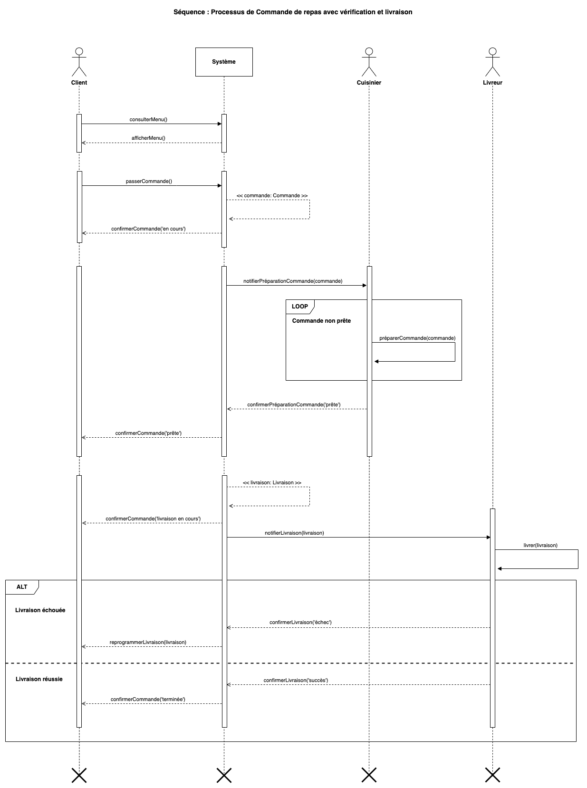

# 04. Le diagramme de Séquence

## Présentation

Le diagramme de séquence en UML est utilisé pour modéliser l'interaction entre les différents objets ou composants d'un
système en montrant la chronologie des messages échangés entre eux. C'est un outil puissant pour visualiser l'ordre
d'exécution des interactions et la manière dont elles s'enchaînent pour réaliser des fonctionnalités spécifiques du
système.

## Utilité dans le Développement Logiciel

### Analyse des exigences :

Ces diagrammes sont utiles pour capturer les exigences fonctionnelles d'une fonctionnalité. Ils aident les analystes
métier, les développeurs, et les parties prenantes à comprendre comment les objets du système interagissent pour
répondre à un besoin particulier.

### Conception technique :

Lors de la phase de conception, les diagrammes de séquence permettent de traduire les exigences en interactions
concrètes entre les différents objets logiciels. Cela aide à planifier la distribution des responsabilités entre les
objets ou classes.

### Documentation :

Ils fournissent une documentation visuelle claire des interactions critiques au sein du système, ce qui permet de
faciliter la compréhension du code pour les nouveaux membres de l'équipe ou les développeurs qui ne connaissent pas tous
les aspects d'une fonctionnalité.

### Débogage et tests :

Lors du débogage ou de la création de tests, ces diagrammes permettent aux testeurs et aux développeurs d'identifier les
étapes à vérifier, en s'assurant que les interactions suivent l'ordre prévu.

## Symboles et Éléments

### Acteur :

Représente une entité externe au système qui interagit avec celui-ci (utilisateur, autre système, etc.).  
Symbolisé par une icône de bonhomme stylisé.

### Objet :

Un objet ou une instance qui participe à l'interaction.  
Représenté par un rectangle contenant le nom de l'objet, généralement avec une ligne de vie qui descend verticalement à
partir de lui.

### Ligne de vie :

Une ligne verticale qui part de l'acteur ou de l'objet et représente leur existence pendant la durée de l'interaction.  
Elle est continue tant que l'objet ou l'acteur est actif dans le scénario.

### Fin de vie :

Indique la destruction ou la fin de la participation de l'objet ou de l'acteur.  
Symbolisé par un "X" à la fin de la ligne de vie.

### Barre d'activation (focus de contrôle) :

Représente une période pendant laquelle un objet ou un acteur exécute une action.  
C'est une barre verticale placée sur la ligne de vie pendant la durée de l'exécution d'une méthode ou d'une activité.

### Alternative (alt) :

Utilisée pour modéliser des blocs conditionnels (si/alors/sinon).  
Représenté par un cadre rectangulaire divisé en sections, avec les conditions associées à chaque section. Il inclut
généralement les mots-clés « alt ».

### Loop :

Modélise une boucle répétitive dans le diagramme.  
Représentée par un cadre rectangulaire avec une étiquette « loop » au-dessus, indiquant que les messages à l'intérieur
sont répétés.

### Message synchrone :

Un appel de méthode où l'expéditeur attend une réponse avant de continuer.  
Représenté par une flèche pleine, pointue à l'extrémité, allant de l'envoyeur au récepteur.

### Message asynchrone :

Un message où l'expéditeur n'attend pas de réponse et continue son exécution.  
Représenté par une flèche pleine avec une pointe ouverte.

### Message de création :

Utilisé pour créer un objet pendant l'exécution.  
Représenté par une flèche pointue allant vers la ligne de vie de l'objet nouvellement créé. La ligne de vie commence à
partir de ce message.

### Message de réponse :

Représente le retour d'un message synchrone (comme une réponse après un appel de méthode).  
Représenté par une flèche en pointillés, allant du récepteur à l'expéditeur.

### Message de retour asynchrone :

Le retour d'un message asynchrone, similaire au message de réponse mais pour un message asynchrone.  
Représenté aussi par une flèche en pointillés, mais le flux est généralement plus libre car l'expéditeur ne l'attend pas
immédiatement.

## Exercices pratiques

### [Plateforme de Gestion d'Événements pour Entreprises](../Exercices/E%CC%81nonce%CC%81/04%20-%20Diagramme%20de%20S%C3%A9quence%20-%20Exercice%201.md)

### [Distributeur Automatique de Billets (ATM)](../Exercices/E%CC%81nonce%CC%81/04%20-%20Diagramme%20de%20S%C3%A9quence%20-%20Exercice%202.md)
