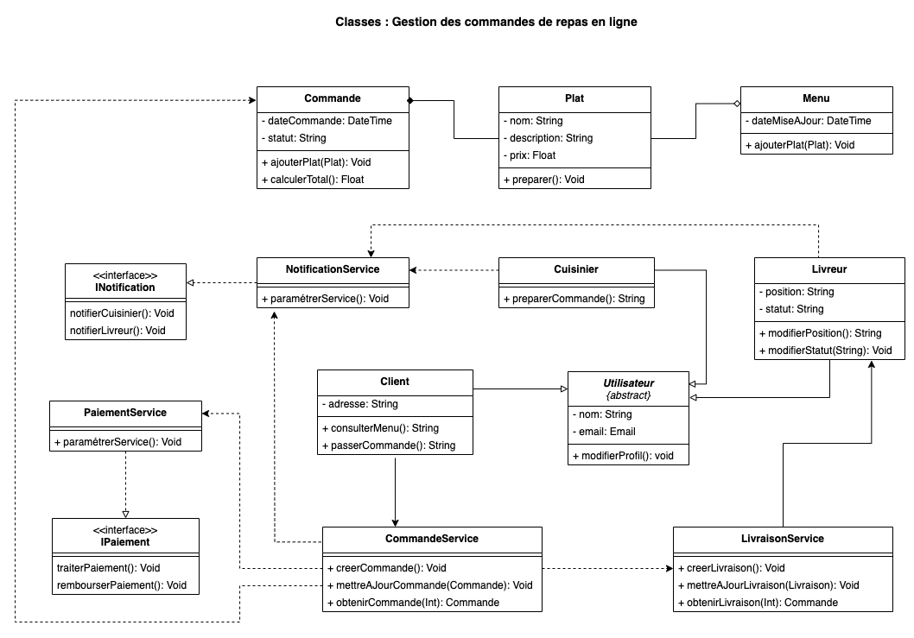
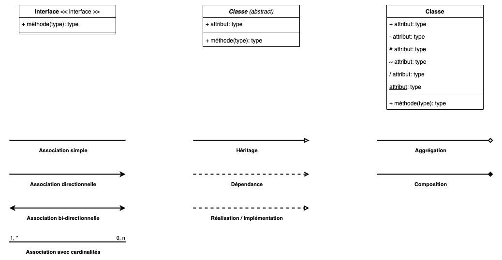

# 05. Le diagramme de Classes

## Notions avancées en POO

### [cf. Annexe 01](Annexe%2001%20-%20Notions%20avanc%C3%A9es%20de%20POO.md)

## Présentation

Le diagramme de classes est un élément central de la modélisation UML, fournissant une vue structurée du système. Il
définit la structure des classes du logiciel, leurs attributs, leurs méthodes, ainsi que les relations qu'elles
entretiennent entre elles. Ce diagramme joue un rôle crucial dans la conception orientée objet, permettant aux
architectes logiciels de planifier la manière dont le système est organisé.

## Utilité dans le Développement Logiciel

### Conception Orientée Objet :

Les diagrammes de classes facilitent la modélisation des concepts réels sous forme de classes, aidant les développeurs à
visualiser les objets du système et leurs relations. Ils constituent une base solide pour l'implémentation des principes
SOLID.

### Documentation :

Ils fournissent une documentation visuelle des classes, des attributs, et des méthodes, ce qui simplifie la
compréhension du code par les développeurs qui rejoignent le projet ou qui en prennent la maintenance.

### Optimisation et Refactorisation :

Le diagramme aide les développeurs à identifier les duplications ou les dépendances excessives entre les classes, ce qui
facilite la refactorisation et l'amélioration continue du design.

### Collaboration d'Équipe :

Le diagramme de classes sert de langage commun entre les architectes, les développeurs et les autres parties prenantes,
en alignant les attentes et les objectifs dès la phase de conception.

## Symboles et Éléments

### Interface :

- **Symbole :** Représentée par un rectangle avec un nom précédé ou suivi du mot-clé `<<interface>>`.
- **Utilisation :** Une interface définit un contrat (ensemble de méthodes sans implémentation) que les classes doivent
  respecter si elles l'implémentent.

### Classe abstraite (abstract) :

- **Symbole :** Représentée comme une classe avec le nom en italique ou précédé ou suivi du mot-clé `abstract`.
- **Utilisation :** Une classe abstraite ne peut pas être instanciée directement. Elle définit des méthodes
  partiellement implémentées ou non implémentées que les sous-classes doivent définir.

### Classe :

- **Symbole :** Représentée par un rectangle divisé en trois sections : le nom de la classe, ses attributs, et ses
  méthodes.
- **Utilisation :** Elle représente une entité ou un concept avec des propriétés (attributs) et des comportements (
  méthodes).

### Attribut :

- **Symbole :** Les attributs sont listés dans la section du milieu d’une classe, sous la forme nom : type (ex : age :
  int).
- **Utilisation :** Un attribut représente une propriété ou un champ de données dans une classe.

### Méthode :

- **Symbole :** Les méthodes sont listées dans la section inférieure d’une classe, sous la forme nom(paramètres) :
  typeRetour (ex : getAge() : int).
- **Utilisation :** Une méthode représente un comportement ou une fonction associée à la classe.

### Visibilité :

Les symboles précédant les attributs et méthodes indiquent la visibilité d'un attribut ou d'une métode :

- `+` **Public :** Accessible depuis n'importe quelle autre classe ou composant du programme. Cela signifie qu'aucune
  restriction n'est imposée à l'accès ou à l'utilisation de l'élément.
- `#` **Protégé :** Accessible uniquement par les classes qui sont des descendants (sous-classes) de la classe où
  l'élément protégé est déclaré. Cela permet un accès plus restreint que le public, protégeant l'élément des accès
  extérieurs tout en permettant son utilisation par les classes dérivées.
- `-` **Privé :** L'accès est strictement limité à la classe dans laquelle l'élément est déclaré. Aucune autre classe,
  même une sous-classe, ne peut accéder à cet élément directement. Cela est utilisé pour cacher les détails
  d'implémentation de la classe et encourager l'encapsulation.
- `~` **Package :** Accessible uniquement par les classes qui sont dans le même paquet. Ce niveau de visibilité est
  utilisé pour contrôler l'accès au sein d'un même regroupement logique de classes qui travaillent ensemble de manière
  interne, sans exposer l'élément au-delà des frontières du paquet.
- `/` **Dérivé :** Indique que l'attribut n'est pas stocké directement mais calculé ou dérivé d'autres attributs ou
  relations. Les attributs dérivés sont souvent marqués par une barre oblique pour indiquer qu'ils sont le résultat d'
  une opération ou d'une méthode spécifique. Par exemple, un attribut âge pourrait être dérivé de la date de naissance.
- `souligné` **Statique :** Indique que l'élément (attribut ou méthode) appartient à la classe elle-même plutôt qu'à une
  instance spécifique de la classe. Cela signifie que l'élément est partagé entre toutes les instances de la classe. En
  UML, un nom souligné signifie que l'élément est statique.

### Relations entre classes

#### Association simple :

- **Symbole :** Une ligne pleine entre deux classes.
- **Utilisation :** Utilisée pour indiquer qu'une classe est liée à une autre par une relation sans direction
  particulière.
- **Contexte :** Ex. Un Employé est associé à une Entreprise (relation non orientée).

#### Association directionnelle :

- **Symbole :** Une ligne pleine avec une flèche pointant vers la classe cible.
- **Utilisation :** Indique qu'une classe est consciente d'une autre et peut utiliser ses services.
- **Contexte :** Ex. Un Client commande des Produits (le Client connaît les Produits, mais pas forcément l'inverse).

#### Association bi-directionnelle :

- **Symbole :** Une ligne pleine sans flèche ou avec deux flèches aux deux extrémités.
- **Utilisation :** Indique que les deux classes sont conscientes l'une de l'autre.
- **Contexte :** Ex. Un Professeur enseigne à un Étudiant, et l'étudiant connaît son professeur.

#### Association avec cardinalité :

- **Symbole :** Une ligne avec des nombres aux extrémités, spécifiant combien d'instances d'une classe peuvent être
  liées à l'autre. Ex : 1..* pour une relation "un à plusieurs".
- **Utilisation :** Utilisée pour définir des contraintes quantitatives sur la relation entre deux classes.
- **Contexte :** Ex. Un Projet est lié à 1..n Employés (un projet peut avoir un ou plusieurs employés).

#### Héritage (généralisation) :

- **Symbole :** Une ligne avec un triangle ouvert pointant vers la classe parente.
- **Utilisation :** Indique qu'une classe hérite des attributs et des méthodes d'une autre classe.
- **Contexte :** Ex. Voiture hérite de Véhicule.

#### Dépendance :

- **Symbole :** Une ligne en pointillés avec une flèche.
- **Utilisation :** Indique qu'une classe utilise les services d'une autre temporairement, mais sans lien fort.
- **Contexte :** Ex. Une classe Commande dépend temporairement d'une classe Facture pour générer un reçu.

#### Réalisation :

- **Symbole :** Une ligne en pointillés avec un triangle ouvert pointant vers l'interface.
- **Utilisation :** Indique qu'une classe concrète implémente une interface.
- **Contexte :** Ex. VoitureÉlectrique réalise l'interface Rechargeable.

#### Implémentation :

- **Symbole :** C'est généralement un synonyme de réalisation dans le contexte UML. Il désigne comment une classe
  concrète implémente une interface.
- **Contexte :** Ex. Voiture implémente MoyenDeTransport.

#### Agrégation :

- **Symbole :** Une ligne pleine avec un losange vide (blanc) à l'extrémité côté contenant.
- **Utilisation :** Indique une relation de "tout/partie" où la partie peut exister indépendamment du tout.
- **Contexte :** Ex. Une Équipe est composée de plusieurs Joueurs. Les joueurs peuvent exister en dehors de l'équipe.

#### Composition :

- **Symbole :** Une ligne pleine avec un losange rempli (noir) à l'extrémité côté contenant.
- **Utilisation :** Une relation "tout/partie" où la partie ne peut pas exister sans le tout.
- **Contexte :** Ex. Une Maison est composée de Pièces. Si la maison est détruite, les pièces le sont aussi.

### Utilisation contextuelle des relations :

Les relations ne sont pas toutes utilisées en même temps dans un diagramme de classes. Elles sont choisies en fonction
du scénario à modéliser :

- **Héritage** est utilisé quand on a besoin de partager du comportement entre classes parentes et enfants.
- **Dépendance** est souvent utilisée pour des relations faibles et temporaires entre classes.
- **Association directionnelle et bi-directionnelle** sont courantes dans les relations où les objets interagissent de
  manière continue.
- **Agrégation et composition** sont utilisées lorsque vous avez des relations "tout/partie", mais la composition
  implique une relation plus forte.

## Exercices pratiques

### [Plateforme de Gestion d'Événements](../Exercices/E%CC%81nonce%CC%81/05%20-%20Diagramme%20de%20Classes%20-%20Exercice%201.md)

### [Système de réservation de bibliothèque en ligne](../Exercices/E%CC%81nonce%CC%81/05%20-%20Diagramme%20de%20Classes%20-%20Exercice%202.md)
