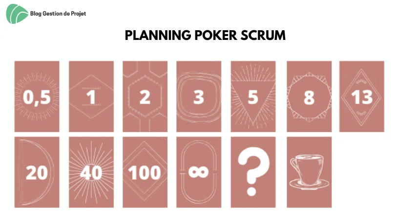
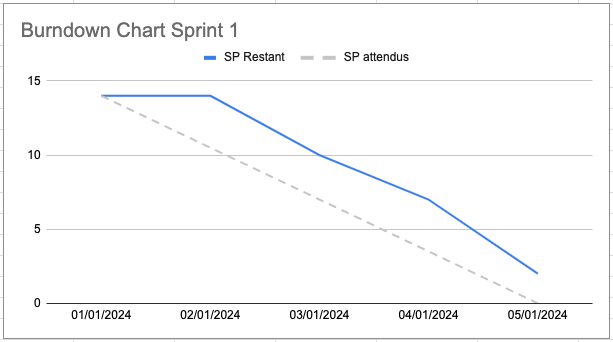
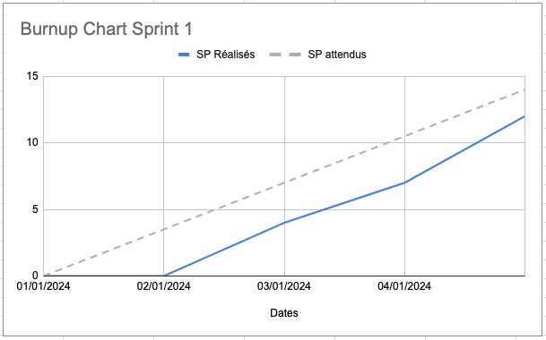
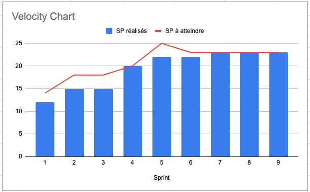
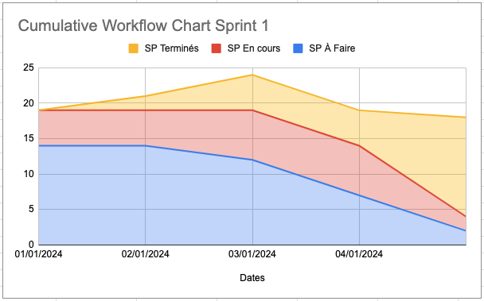

## Focus sur Scrum

### Qu'est-ce que Scrum ?

**Scrum** est une méthodologie agile développée pour gérer des projets complexes et dynamiques, en particulier dans le
domaine du développement logiciel. Il repose sur un cadre structuré mais flexible qui permet aux équipes de travailler
de manière incrémentale et itérative, tout en s'adaptant rapidement aux changements. Scrum est basé sur trois piliers
fondamentaux : la **transparence**, l'**inspection**, et l'**adaptation**.

#### Les valeurs de Scrum

Scrum repose sur cinq valeurs clés qui guident les équipes dans leur travail quotidien :

1. **Courage** : L’équipe doit avoir le courage de prendre des décisions difficiles et d’aborder les problèmes de
   manière proactive.
2. **Focus** : Chaque membre de l’équipe doit rester concentré sur les objectifs du sprint et sur la valeur à apporter
   au client.
3. **Ouverture** : L’équipe doit être ouverte aux retours, aux changements, et aux nouveaux défis.
4. **Respect** : Chaque membre de l’équipe doit respecter les compétences et les contributions des autres.
5. **Engagement** : Chaque membre s'engage à atteindre les objectifs du sprint et à fournir un produit de haute qualité.

### Les piliers de Scrum

#### 1. Transparence

La transparence est essentielle dans Scrum. Toutes les parties prenantes doivent avoir une vue claire de l’état du
projet et du travail effectué. Cela implique une transparence totale dans les processus, les progrès, et les résultats
attendus. Le tableau Scrum (physique ou numérique) ainsi que les artefacts (Product Backlog, Sprint Backlog) sont les
principaux outils permettant cette transparence.

#### 2. Inspection

Les processus Scrum doivent être régulièrement inspectés pour détecter les écarts par rapport aux objectifs ou les
problèmes potentiels. Les événements Scrum, comme la **Daily Scrum** et la **Sprint Review**, offrent des opportunités
d’inspection et d’ajustement.

#### 3. Adaptation

Scrum encourage l’adaptation rapide aux changements. Que ce soit à la suite d'une inspection ou en réponse à des retours
utilisateurs, l’équipe doit pouvoir ajuster son approche, son Backlog ou ses objectifs pour rester alignée avec les
attentes.

### Les rôles dans Scrum

#### 1. Le Scrum Master

Le **Scrum Master** est le facilitateur de l’équipe Scrum. Son rôle principal est de s'assurer que l'équipe comprend et
applique correctement le cadre Scrum. Il protège l'équipe des distractions externes et aide à lever les obstacles qui
peuvent ralentir ou bloquer le travail. Le Scrum Master n'est pas un manager, mais un serviteur-leader qui aide l’équipe
à s'auto-organiser et à s’améliorer.

#### 2. Le Product Owner

Le **Product Owner** est responsable de maximiser la valeur du produit et du travail de l’équipe de développement. Il
est chargé de gérer le **Product Backlog**, qui contient toutes les tâches, fonctionnalités et améliorations à réaliser.
Le Product Owner est la voix du client et des parties prenantes, et il s'assure que les besoins de ces derniers sont
correctement priorisés.

#### 3. L'Équipe de développement

L'**équipe de développement** est un groupe auto-organisé et multidisciplinaire qui est responsable de la réalisation
des tâches du sprint. Les membres de l’équipe de développement travaillent ensemble pour transformer les éléments du
Sprint Backlog en incréments fonctionnels et testés. Il n'y a pas de rôles spécifiques au sein de cette équipe : tous
les membres contribuent au développement du produit.

### Les artefacts dans Scrum

#### 1. Le Product Backlog

Le **Product Backlog** est une liste priorisée de tout le travail à faire sur le produit. Il est géré et priorisé par le
Product Owner, mais peut être modifié en fonction des retours des parties prenantes ou des changements dans les
priorités. Le Product Backlog évolue constamment et peut contenir des fonctionnalités, des corrections de bugs, des
tâches techniques ou des recherches à effectuer.

#### 2. Le Sprint Backlog

Le **Sprint Backlog** est un sous-ensemble du Product Backlog, sélectionné lors du **Sprint Planning** pour être
travaillé pendant un sprint. Il contient les éléments que l’équipe de développement s'engage à livrer pendant la durée
du sprint. Ces éléments sont découpés en tâches plus petites que l’équipe va accomplir au quotidien.

#### 3. L'incrément

Un **incrément** est une version fonctionnelle et potentiellement livrable du produit à la fin de chaque sprint. Chaque
incrément s'ajoute à ceux qui ont été produits précédemment, avec pour objectif d’améliorer continuellement le produit.
L’incrément doit être testé, intégré et prêt à être utilisé par le client ou les utilisateurs finaux.

### Les événements dans Scrum

#### 1. Sprint Planning

Le **Sprint Planning** est la réunion qui marque le début d’un sprint. Lors de cette réunion, l’équipe Scrum (Product
Owner, Scrum Master, équipe de développement) détermine les objectifs du sprint et sélectionne les éléments du Product
Backlog qui seront inclus dans le Sprint Backlog. Le Sprint Planning repose sur deux questions essentielles :

1. **Que pouvons-nous livrer à la fin du sprint ?**
2. **Comment allons-nous accomplir ce travail ?**

#### 2. Daily Scrum (Mêlée quotidienne)

La **Daily Scrum** est une réunion quotidienne de 15 minutes, souvent appelée "mêlée", durant laquelle l’équipe de
développement se synchronise. Chaque membre partage :

1. Ce qu'il a fait la veille.
2. Ce qu'il prévoit de faire aujourd'hui.
3. Les obstacles ou problèmes qu'il rencontre.

Le but est de maintenir une vue d'ensemble du travail en cours et d'identifier rapidement les problèmes.

#### 3. Sprint Review

La **Sprint Review** est un événement clé qui se déroule à la fin de chaque sprint. Elle offre une opportunité à
l'équipe de démontrer le travail réalisé au cours du sprint et d’obtenir des retours des parties prenantes, ce qui peut
influencer la planification future. La Sprint Review est plus qu'une simple démonstration : elle permet d'examiner
l'avancement du projet par rapport aux objectifs fixés et de discuter des ajustements possibles du **Product Backlog**.

#### Objectifs de la Sprint Review

Les principaux objectifs de la Sprint Review sont :

- **Présenter l’incrément** développé au cours du sprint, qui est un produit potentiellement livrable.
- **Obtenir des retours** des parties prenantes, des utilisateurs ou du Product Owner sur l’incrément.
- **Revoir le Product Backlog** pour évaluer les prochaines étapes en fonction des nouvelles priorités ou des
  changements dans les besoins.
- **Célébrer les réussites** et identifier les zones de développement pour le prochain sprint.

#### Participants à la Sprint Review

La Sprint Review inclut tous les acteurs suivants :

- **L’équipe de développement** : Elle présente le travail accompli et répond aux questions des parties prenantes.
- **Le Product Owner** : Il joue un rôle central en expliquant comment les nouveaux incréments s'intègrent dans la
  vision du produit et en collectant les retours.
- **Le Scrum Master** : Il s’assure que la Sprint Review respecte le cadre Scrum et aide à faciliter la discussion.
- **Les parties prenantes** : Des représentants des utilisateurs, des clients ou d’autres équipes internes peuvent être
  présents pour fournir un feedback immédiat.

#### Étapes de la Sprint Review

1. Revue de l’objectif du sprint  
   La Sprint Review commence par un rappel de l’**objectif du sprint**. Cet objectif, défini lors de la **Sprint
   Planning**, décrit les résultats attendus à la fin du sprint. Le Product Owner ou le Scrum Master rappelle cet
   objectif pour cadrer la présentation de l’équipe et s’assurer que tout le monde est aligné.

2. Présentation de l'incrément  
   L’équipe de développement présente les fonctionnalités ou les améliorations réalisées pendant le sprint sous forme
   d’un **incrément fonctionnel**. Cela peut inclure des démonstrations en direct, des captures d’écran, ou des exemples
   de nouvelles fonctionnalités qui ont été intégrées au produit.

    - **Exemple concret** : Si l’équipe a travaillé sur l’ajout d’une fonctionnalité de filtre de recherche, elle peut
      démontrer comment l'utilisateur final pourra utiliser ce filtre dans l’interface.

   Le but est de montrer un produit utilisable et prêt à être livré si nécessaire. Chaque membre de l’équipe peut
   intervenir pour expliquer le travail qu’il a accompli ou répondre à des questions techniques.

3. Discussion autour des retours et ajustements  
   Les **retours** sont un élément essentiel de la Sprint Review. Les parties prenantes et le Product Owner posent des
   questions, donnent leurs impressions et suggèrent des améliorations. Cela permet d'ajuster le Product Backlog en
   fonction des nouveaux besoins ou des retours utilisateurs.

    - **Exemple concret** : Après la présentation d'une fonctionnalité, un utilisateur final suggère que l'ajout d'une
      option supplémentaire de tri des résultats de recherche serait utile. Le Product Owner peut alors décider
      d'ajouter cette suggestion au Product Backlog pour les futurs sprints.

4. Revue du Product Backlog et planification future  
   Après avoir discuté de l’incrément et des retours, l’équipe et le Product Owner revoient le **Product Backlog**. Le
   Product Owner peut alors ajuster la **priorisation** des éléments en fonction des retours obtenus pendant la Sprint
   Review ou de nouveaux objectifs commerciaux.

    - **Exemple concret** : Si une fonctionnalité a suscité des retours très positifs, le Product Owner peut décider de
      prioriser les tâches connexes pour le prochain sprint. À l'inverse, si une fonctionnalité est moins critique, elle
      peut être repoussée.

5. Conclusion et prochaines étapes  
   La Sprint Review se termine par une discussion sur les **prochaines étapes** et sur la façon dont l’équipe abordera
   le prochain sprint. Cette conclusion permet à l’équipe de partir sur une base solide pour le **Sprint Planning** à
   venir. L’équipe peut également souligner les points positifs du sprint qui vient de s’achever.

#### L'importance de la Sprint Review

La Sprint Review est cruciale pour maintenir l’**alignement** entre les attentes des parties prenantes et les résultats
produits par l’équipe de développement. Elle :

- **Garantit la transparence** sur l'avancement du projet.
- **Favorise l'amélioration continue** en recueillant des retours réguliers sur les incréments livrés.
- **Encourage la collaboration** entre l’équipe de développement, le Product Owner, et les parties prenantes.
- **Assure l'ajustement du backlog** pour répondre aux évolutions du projet et aux besoins des utilisateurs.

La Sprint Review n’est pas un simple bilan : c’est une opportunité d’ajustement et de recalibrage des priorités en
fonction des retours réels. Cela permet d’assurer que l’équipe Scrum reste sur la bonne voie et que les besoins des
utilisateurs sont toujours au centre du processus de développement.

#### 4. Sprint Retrospective

La **Sprint Retrospective** se tient après la **Sprint Review** et permet à l’équipe Scrum de réfléchir sur le sprint
qui vient de se terminer. Le but est d'identifier ce qui a bien fonctionné, ce qui pourrait être amélioré, et comment
l’équipe peut s’améliorer pour les futurs sprints. La rétrospective est une opportunité d'itération non seulement sur le
produit, mais aussi sur le processus lui-même.

Le cadre de la rétrospective est très flexible, mais elle doit toujours aborder trois points principaux :

1. **Ce qui s’est bien passé** : Les succès, les bonnes pratiques à conserver.
2. **Ce qui peut être amélioré** : Les difficultés rencontrées, les obstacles ou les processus inefficaces.
3. **Les actions à entreprendre** : Les mesures concrètes que l’équipe prendra pour améliorer son travail lors des
   prochains sprints.

#### Outils et techniques pour améliorer la Sprint Retrospective

#### Speedboat

Le **Speedboat** est un outil de facilitation visuelle très utilisé lors des rétrospectives Scrum. Il permet à l’équipe
d’identifier ce qui a ralenti le projet (les obstacles) et ce qui l’a aidé à aller plus vite (les moteurs). L’analogie
du bateau représente le projet ou l’équipe, tandis que les ancres symbolisent les obstacles qui ralentissent le bateau,
et le vent représente les éléments positifs qui ont permis d’accélérer le progrès.

Voici comment fonctionne une rétrospective basée sur le **Speedboat** :

- Un dessin d’un bateau est placé sur un tableau (physique ou numérique), avec une île au loin représentant l’objectif
  du sprint.
- L’équipe identifie les **ancres** (les problèmes ou obstacles) qui ont ralenti le projet. Ces ancres sont placées sous
  le bateau.
- L’équipe identifie également les **vents favorables** (les facteurs positifs) qui ont poussé le bateau vers
  l'objectif. Ces vents sont dessinés derrière le bateau.
- Une discussion s’ensuit pour décider des actions correctives afin de lever les obstacles et renforcer les moteurs pour
  les prochains sprints.

- **Exemple** : Lors d’une rétrospective, l’équipe identifie comme ancre le manque de clarté dans certaines User
  Stories, ce qui a causé des retards. Comme vent favorable, l’équipe note une bonne collaboration entre les
  développeurs et le Product Owner. En conclusion, l’équipe propose une action d'amélioration pour mieux affiner les
  User Stories durant le Backlog Refinement.

#### ROTI (Return On Time Invested)

Le **ROTI** est une méthode simple pour mesurer l’efficacité de la rétrospective elle-même. À la fin de la réunion,
chaque membre de l’équipe évalue si la rétrospective a été utile par rapport au temps investi. Cette évaluation est
faite sur une échelle de 1 à 5, où 1 signifie "perte de temps" et 5 "très utile". Si la note moyenne est faible, cela
peut indiquer que la rétrospective doit être améliorée.

- **Exemple** : Si le score moyen est de 3, l’équipe peut discuter des raisons de cette note et décider de changer la
  méthode de rétrospective pour la rendre plus engageante ou utile. Par exemple, si les discussions sont trop longues ou
  si certains membres ne participent pas activement, l’équipe peut décider de limiter la durée de chaque intervention ou
  de mieux structurer la rétrospective pour encourager plus de participation.

#### Start, Stop, Continue

La méthode **Start, Stop, Continue** est une autre technique populaire pour structurer les rétrospectives. Elle
encourage l'équipe à réfléchir sur les processus ou comportements qu'elle doit **commencer** (Start), **arrêter** (
Stop), et **continuer** (Continue). Cette technique aide à organiser les actions à entreprendre pour améliorer le
prochain sprint de manière simple et claire.

- **Start** : Ce que l’équipe devrait commencer à faire pour améliorer les performances. Cela peut inclure de nouvelles
  pratiques ou outils.
- **Stop** : Ce qui ne fonctionne pas et que l’équipe devrait arrêter de faire pour éviter les problèmes ou la perte de
  temps.
- **Continue** : Ce qui fonctionne bien et doit être maintenu pour assurer la continuité des bonnes pratiques.

- **Exemple** : Lors d'une rétrospective, l'équipe décide de "commencer" à utiliser des tests unitaires plus
  fréquemment, "arrêter" les longues discussions non-structurées lors des réunions, et "continuer" la collaboration
  proactive entre le Product Owner et l'équipe de développement.

#### 4Ls (Liked, Learned, Lacked, Longed For)

Le **4Ls** est une méthode de rétrospective qui permet de structurer la réflexion autour de quatre points :

- **Liked** : Ce que l’équipe a apprécié durant le sprint (les succès).
- **Learned** : Ce que l’équipe a appris (les leçons acquises).
- **Lacked** : Ce qui a manqué ou ce que l’équipe aurait aimé avoir (ressources, informations, etc.).
- **Longed For** : Ce que l’équipe espère avoir dans les futurs sprints (outils, processus, améliorations).

Cette méthode est idéale pour encourager la réflexion de manière positive tout en abordant les problèmes de manière
constructive.

- **Exemple** : L'équipe pourrait dire qu'elle a apprécié l'utilisation du tableau Kanban (Liked), qu'elle a appris à
  mieux prioriser les tâches (Learned), qu'elle a manqué de communication claire sur certaines User Stories (Lacked), et
  qu'elle souhaite une meilleure coordination avec les parties prenantes dans les prochains sprints (Longed For).

#### Retrospective Radar

Le **Retrospective Radar** est un outil visuel utilisé pour évaluer plusieurs aspects du travail d’équipe, comme la
communication, la collaboration, la qualité du code, ou le respect des délais. Un graphique en forme de radar est
utilisé pour mesurer et discuter ces critères. Chaque membre de l’équipe donne une note à chaque critère, et les notes
sont tracées sur le radar. Cela permet de visualiser rapidement les points forts et les faiblesses.

- **Exemple** : Lors d’une rétrospective, l’équipe utilise un radar pour noter des critères tels que "qualité du
  code", "respect des deadlines", "communication", et "collaboration". Les résultats montrent que la communication
  interne est satisfaisante, mais que la qualité du code pourrait être améliorée par des revues de code plus régulières.

### Importance des rétrospectives pour l'amélioration continue

Les rétrospectives ne sont pas seulement une opportunité d'évaluer la performance d'un sprint, elles sont un élément clé
de l'**amélioration continue**. En examinant régulièrement ce qui fonctionne et ce qui peut être amélioré, l'équipe
Scrum peut affiner ses processus, éliminer les obstacles et maximiser la productivité. C’est aussi une excellente
occasion pour renforcer la cohésion d’équipe et pour s'assurer que tout le monde se sente entendu et impliqué dans
l'évolution du projet.

### Les User Stories

Les **User Stories** sont des descriptions simples et concises de fonctionnalités du point de vue de l’utilisateur
final. Elles permettent de clarifier les besoins en mettant l'accent sur la valeur apportée à l'utilisateur. Une User
Story typique est formulée ainsi :  
**En tant que [type d’utilisateur], je veux [objectif], afin de [bénéfice].**

- **Exemple** : En tant qu’utilisateur enregistré, je veux recevoir un e-mail de confirmation après chaque achat, afin
  d’avoir une preuve de transaction.

Les User Stories sont souvent accompagnées de **critères d’acceptation**, qui définissent ce qui doit être vrai pour que
la User Story soit considérée comme terminée.

#### Critères INVEST pour définir et évaluer les User Stories

Les **User Stories** doivent être bien définies pour être facilement comprises, développées, et testées par l'équipe. Le
modèle **INVEST** est un ensemble de critères qui permet de s'assurer que les User Stories sont de qualité et prêtes à
être incluses dans un sprint. **INVEST** est un acronyme qui signifie :

- **I**ndependent (Indépendante) :  
  Une User Story doit être **indépendante** des autres. Cela signifie que l'équipe doit pouvoir la développer et la
  livrer sans qu'elle dépende directement d'une autre User Story. L'indépendance facilite la priorisation et le
  développement parallèle des tâches.
    - **Exemple** : Une User Story telle que "En tant qu’utilisateur, je veux pouvoir me connecter pour accéder à mon
      tableau de bord" doit être indépendante des User Stories liées à d'autres fonctionnalités comme l'enregistrement
      des utilisateurs ou la gestion des paramètres.
- **N**egotiable (Négociable) :  
  Les User Stories ne doivent pas être vues comme des contrats rigides, mais plutôt comme des points de départ pour une
  discussion. Elles doivent rester **négociables**, ce qui signifie que les détails peuvent être discutés et ajustés
  entre le Product Owner et l'équipe de développement.
    - **Exemple** : Si une User Story demande un filtre spécifique pour une recherche dans une base de données, l'équipe
      de développement peut discuter avec le Product Owner pour définir ensemble la meilleure manière de mettre en œuvre
      cette fonctionnalité, selon les contraintes techniques ou les priorités.
- **V**aluable (Valuable) :  
  Chaque User Story doit apporter une **valeur** tangible à l'utilisateur ou au client. Cela signifie qu'elle doit
  répondre à un besoin spécifique ou résoudre un problème important. La valeur de la User Story doit être clairement
  définie pour garantir que le travail de développement soit aligné avec les objectifs business.
    - **Exemple** : "En tant qu’utilisateur, je veux recevoir des notifications par e-mail quand ma commande est
      expédiée" apporte de la valeur à l'utilisateur en améliorant l'expérience d'achat et en renforçant la satisfaction
      client.
- **E**stimable (Estimable) :  
  Une User Story doit être **estimable**, c’est-à-dire que l'équipe doit être capable d'évaluer le temps ou les efforts
  nécessaires pour la réaliser. Si une User Story est trop vague ou mal définie, elle ne pourra pas être estimée
  correctement, ce qui risque de compromettre la planification du sprint.
    - **Exemple** : "En tant qu’administrateur, je veux gérer les droits d’accès des utilisateurs" doit être
      suffisamment détaillée pour que l'équipe puisse estimer le temps qu'il faudra pour la développer. Si la User Story
      est trop large ou incertaine, elle peut être décomposée en plusieurs stories plus précises.
- **S**mall (Petite) :  
  Une User Story doit être suffisamment **petite** pour être complétée dans le cadre d'un sprint, généralement en moins
  d'une semaine. Si une User Story est trop complexe ou large, elle doit être subdivisée en sous-stories plus petites et
  plus faciles à gérer. Cela permet d'éviter que des tâches ne s'étendent sur plusieurs sprints.
    - **Exemple** : Au lieu d’avoir une User Story trop large comme "Créer une fonctionnalité de gestion de commande",
      celle-ci peut être divisée en plusieurs stories plus petites : "Ajouter des produits au panier", "Valider une
      commande", "Envoyer une confirmation de commande".
- **T**estable (Testable) :  
  Une User Story doit être **testable**, c’est-à-dire que des critères d'acceptation clairs doivent être définis afin de
  déterminer si la User Story est terminée et fonctionne comme prévu. Ces critères d'acceptation servent de référence
  pour les tests, garantissant que la fonctionnalité respecte les attentes.
    - **Exemple** : Pour la User Story "En tant qu'utilisateur, je veux pouvoir réinitialiser mon mot de passe via un
      lien e-mail", les critères d'acceptation pourraient être : "L’utilisateur doit recevoir un e-mail avec un lien de
      réinitialisation valide", "Le lien de réinitialisation doit expirer après 24 heures", "L’utilisateur doit pouvoir
      définir un nouveau mot de passe via le lien".

### Les Story Points (points d'histoire)

Les **Story Points** sont une unité de mesure utilisée pour estimer la complexité d'une User Story ou d'une tâche dans
le backlog. Plutôt que d’estimer en heures ou en jours, les Story Points permettent de prendre en compte à la fois
l'effort, l'incertitude et la complexité de la tâche. Les Story Points sont souvent attribués de manière relative, en
comparant une tâche à une autre.

- **Exemple** : Si la création d’un formulaire simple est évaluée à 2 Story Points, une tâche plus complexe, comme
  l’intégration d’une API externe, pourrait être évaluée à 5 ou 8 Story Points.

### Le Planning Poker

Le **Planning Poker** est une technique d'estimation utilisée par les équipes Scrum pour attribuer des Story Points aux
User Stories. Chaque membre de l’équipe reçoit un jeu de cartes avec des chiffres (souvent issus de la suite de
Fibonacci). Le Product Owner présente une User Story, et chaque membre de l’équipe sélectionne secrètement une carte
pour indiquer son estimation. Les cartes sont ensuite révélées simultanément, et l’équipe discute des écarts jusqu'à
parvenir à un consensus.

- **Exemple** : Une User Story est discutée et un membre de l'équipe pense qu'elle vaut 3 Story Points, tandis qu'un
  autre estime qu'elle vaut 8. L'équipe discute de la complexité et des risques associés pour parvenir à une estimation
  commune.

### Les graphiques d'avancement et statistiques

#### Le Burndown Chart

Le **Burndown Chart** est un graphique qui montre la quantité de travail restant dans un sprint ou un projet. Il permet
à l’équipe de suivre visuellement la progression du sprint en comparant le travail restant (sur l’axe vertical) par
rapport au temps écoulé (sur l’axe horizontal). Le Burndown Chart permet de voir rapidement si l'équipe est en avance ou
en retard par rapport à l'objectif du sprint, et de prendre des mesures correctives si nécessaire.

- **Exemple** : Si le Burndown Chart montre une pente trop lente, cela signifie que l’équipe n’a pas terminé
  suffisamment de tâches par rapport au temps écoulé, et qu’il y a un risque de ne pas terminer le sprint dans les
  délais.

#### Le Burnup Chart

Le **Burnup Chart** est un autre outil de suivi visuel qui montre à la fois la quantité de travail accompli et la
quantité totale de travail à faire. Contrairement au Burndown Chart, qui se concentre uniquement sur le travail restant,
le Burnup Chart met en évidence les progrès réalisés au fil du temps et peut également intégrer les changements dans la
portée du projet.

- **Exemple** : Si des fonctionnalités supplémentaires sont ajoutées en cours de sprint, le Burnup Chart ajustera la
  ligne représentant le travail total, tout en montrant les progrès réalisés par l’équipe. Cela permet de voir si
  l’équipe avance à un bon rythme malgré les ajouts de travail.

#### Le Velocity Chart

Le **Velocity Chart** mesure la quantité de travail terminée par l’équipe à la fin de chaque sprint. Il permet de
calculer la **vélocité** de l’équipe, c’est-à-dire la quantité moyenne de Story Points complétée par sprint. Cela aide
l’équipe à estimer la capacité future et à planifier les sprints suivants.

- **Exemple** : Si une équipe termine en moyenne 30 Story Points par sprint, elle peut utiliser cette vélocité pour
  prédire combien de travail elle pourra accomplir dans les prochains sprints et ajuster le Sprint Backlog en
  conséquence.

#### Le Cumulative Workflow Chart

Le **Cumulative Workflow Chart** est un outil utilisé pour visualiser le flux de travail de l’équipe dans un projet. Ce
diagramme montre le nombre de tâches à différentes étapes (comme "À faire", "En cours", et "Terminé") sur une période
donnée. Il permet de détecter les goulets d’étranglement ou les zones où le travail s'accumule.

- **Exemple** : Si le Cumulative Workflow Chart montre une augmentation constante des tâches "En cours" sans progression
  vers "Terminé", cela indique que des problèmes bloquent le travail. L’équipe peut alors se concentrer sur la
  résolution de ces obstacles pour rétablir un flux de travail fluide.

### Le Backlog Refinement

Le **Backlog Refinement** (ou "affinage du backlog") est une activité continue dans le cadre de Scrum. Elle consiste à
examiner régulièrement le **Product Backlog** afin de le maintenir à jour et bien priorisé. Ce processus permet de
s'assurer que les éléments du backlog sont suffisamment bien définis, estimés et prêts à être inclus dans les prochains
sprints. Le Backlog Refinement est souvent mené de manière informelle, mais il peut également faire l'objet de réunions
dédiées impliquant le **Product Owner** et l'**équipe de développement**.

#### 1. Objectifs du Backlog Refinement

Le Backlog Refinement a plusieurs objectifs principaux :

- **Clarifier les éléments du backlog** : Les User Stories ou autres éléments doivent être suffisamment clairs pour que
  l'équipe comprenne ce qu'il faut réaliser.
- **Prioriser les éléments** : Le Product Owner peut ajuster la priorité des éléments en fonction des besoins du client,
  des retours d'utilisateurs ou des contraintes techniques.
- **Estimer les éléments** : L’équipe de développement peut utiliser des techniques comme le **Planning Poker** pour
  estimer la complexité des User Stories en termes de **Story Points**.
- **Diviser les éléments trop volumineux** : Si une User Story ou une tâche est trop grande pour être réalisée en un
  seul sprint, elle peut être découpée en plusieurs sous-stories plus petites et plus gérables.

#### 2. Fréquence du Backlog Refinement

Contrairement aux événements formels de Scrum (comme le Sprint Planning ou la Sprint Review), le Backlog Refinement n’a
pas de fréquence fixe. Il est généralement réalisé une fois par sprint, ou au fur et à mesure que le Product Backlog
évolue. Certaines équipes choisissent de consacrer un pourcentage de leur temps de sprint à cette activité, tandis que
d’autres l’intègrent de manière continue dans leur flux de travail.

#### 3. Participants au Backlog Refinement

- **Le Product Owner** est au centre du Backlog Refinement, car il est responsable de la gestion du Product Backlog et
  de la priorisation des éléments.
- **L'équipe de développement** participe pour apporter son expertise technique, clarifier les User Stories et estimer
  la charge de travail.
- **Le Scrum Master** peut également être impliqué pour s'assurer que l’activité de refinement reste efficace et alignée
  avec les principes Scrum.

#### 4. Activités pendant le Backlog Refinement

Voici quelques-unes des principales activités qui ont lieu lors du Backlog Refinement :

- **Clarification des User Stories** : Le Product Owner décrit les User Stories, et l'équipe de développement pose des
  questions pour comprendre les exigences et les critères d’acceptation.
- **Évaluation de la priorité** : Le Product Owner ajuste la priorité des éléments en fonction des nouveaux retours ou
  des évolutions du projet.
- **Estimation des Story Points** : L'équipe attribue des Story Points aux User Stories pour estimer leur complexité.
- **Décomposition des tâches** : Les User Stories ou tâches trop complexes sont découpées en éléments plus petits et
  plus faciles à gérer dans le cadre d'un sprint.

#### 5. Importance du Backlog Refinement

Le Backlog Refinement est essentiel pour garantir que le **Sprint Planning** se déroule sans heurts. Lorsque le backlog
est bien affiné, l'équipe peut rapidement sélectionner les éléments du backlog lors du Sprint Planning et se concentrer
sur leur développement. Cela réduit les risques de malentendus, améliore la prévisibilité des livraisons, et permet à
l’équipe de se concentrer sur la production de valeur pendant le sprint.

- **Exemple concret** : Lors d’une session de Backlog Refinement, l’équipe discute d’une User Story liée à l’ajout d’un
  filtre de recherche avancé sur un site web. Le Product Owner clarifie les critères d'acceptation et l’équipe estime la
  complexité de cette User Story. Il est décidé de diviser la tâche en deux : l'ajout du filtre de recherche et
  l'optimisation des résultats de recherche, pour que chaque partie soit réalisée dans des sprints séparés.

## TP : Scrum en pratique

### 
