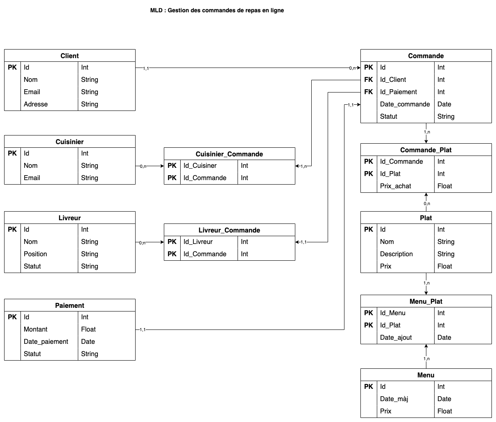

# 01b. Le Modèle Logique des Données (MLD)

## Présentation

Le Modèle Logique des Données (MLD) est une étape clé de la méthode Merise, qui intervient après la création du Modèle
Conceptuel des Données (MCD). Le MLD consiste à transformer le modèle conceptuel, centré sur les entités et leurs
relations, en une structure de données adaptée aux systèmes de gestion de bases de données (SGBD) relationnels.
Contrairement au MCD, qui est une représentation abstraite, le MLD prend en compte les aspects techniques nécessaires
pour organiser les données en tables et définir leurs relations.

L'objectif du MLD est de préparer les données pour leur implémentation dans un SGBD relationnel, tout en conservant la
logique et l'intégrité des données définies dans le MCD. Cette étape est cruciale pour garantir que les données soient
correctement structurées afin d'assurer la performance et la cohérence du système d'information.

Le MLD implique la conversion des entités du MCD en tables, des attributs en colonnes et des relations en clés primaires
et clés étrangères. En outre, il intègre les contraintes d’intégrité, telles que l'unicité des identifiants, les
dépendances fonctionnelles, ainsi que les règles de gestion (cardinalités, contraintes de nullité, etc.).

## Utilité du MLD

Le MLD est essentiel pour plusieurs raisons :

- **Traduction technique du MCD :** Il permet de passer d'une représentation conceptuelle des données (MCD) à une
  structure technique compatible avec les bases de données relationnelles.
- **Organisation des données en tables :** Il définit les tables, les colonnes, et les relations (clés primaires, clés
  étrangères) nécessaires pour représenter les données de manière efficace.
- **Optimisation de la base de données :** Le MLD permet d'optimiser les structures de données, de minimiser les
  redondances et d'améliorer la performance du système de gestion de la base de données.
- **Assurance de l'intégrité :** Il garantit que les relations entre les données sont respectées et que les contraintes
  d'intégrité définies dans le MCD sont bien mises en place dans le modèle logique.

## Symboles et éléments clés du MLD

Les symboles du MLD sont directement inspirés des structures des bases de données relationnelles. Voici les principaux
éléments à prendre en compte lors de la construction du MLD :

- **Table :** Chaque entité du MCD devient une table dans le MLD. Une table est composée de colonnes, qui correspondent
  aux attributs de l'entité.

- **Clé primaire (PK) :** La clé primaire est un ou plusieurs attributs qui permettent d'identifier de manière unique
  chaque enregistrement dans une table. Il est essentiel de définir une clé primaire pour chaque table afin d'assurer l'
  unicité des enregistrements.

- **Clé étrangère (FK) :** Les clés étrangères sont des attributs dans une table qui établissent des relations avec la
  clé primaire d'une autre table. Elles permettent de lier les tables entre elles et de respecter les relations définies
  dans le MCD.

- **Contraintes d'intégrité :** Le MLD doit respecter les contraintes d'intégrité définies dans le MCD, telles que les
  cardinalités (1, 0, etc.), l'obligation ou non d'avoir une valeur pour un attribut (NULL ou NOT NULL), et les
  dépendances fonctionnelles.

- **Index :** Bien qu'ils ne soient pas toujours visibles dans le MLD de base, les index peuvent être définis pour
  accélérer l'accès aux données. Ils sont généralement créés sur les colonnes fréquemment utilisées dans les requêtes de
  recherche.

## Méthode de conception du MLD

La conception du MLD à partir du MCD se fait de manière méthodique en suivant ces étapes :

- **Conversion des entités en tables :** Chaque entité du MCD est transformée en table dans le MLD. Les attributs de
  l'entité deviennent les colonnes de la table.

- **Conversion des relations en clés étrangères :** Les relations entre entités dans le MCD sont transformées en clés
  étrangères dans le MLD. Chaque relation est représentée par une clé étrangère dans l'une des tables concernées.

- **Définition des clés primaires :** Il est nécessaire de définir une clé primaire pour chaque table afin d'assurer l'
  unicité des enregistrements. Cela peut être un attribut existant (comme "ID_Client") ou un nouvel attribut ajouté
  spécifiquement pour cet usage.

- **Ajout des contraintes d'intégrité :** Les contraintes de cardinalité et de dépendance fonctionnelle du MCD sont
  traduites en contraintes de clés étrangères et d'obligations de valeurs (NULL/NOT NULL).

- **Validation avec les parties prenantes :** Avant de passer à la mise en œuvre physique dans le système de gestion de
  base de données, le MLD doit être validé avec les parties prenantes pour s'assurer qu'il correspond bien aux besoins
  et aux contraintes métiers.

## Exercice pratique

### [Système de gestion de réservation de chambres d'hôtel](../Exercices/%C3%89nonc%C3%A9/01b%20-%20Le%20Mod%C3%A8le%20Logique%20des%20Donn%C3%A9es%20-%20Exercice%202.md)
